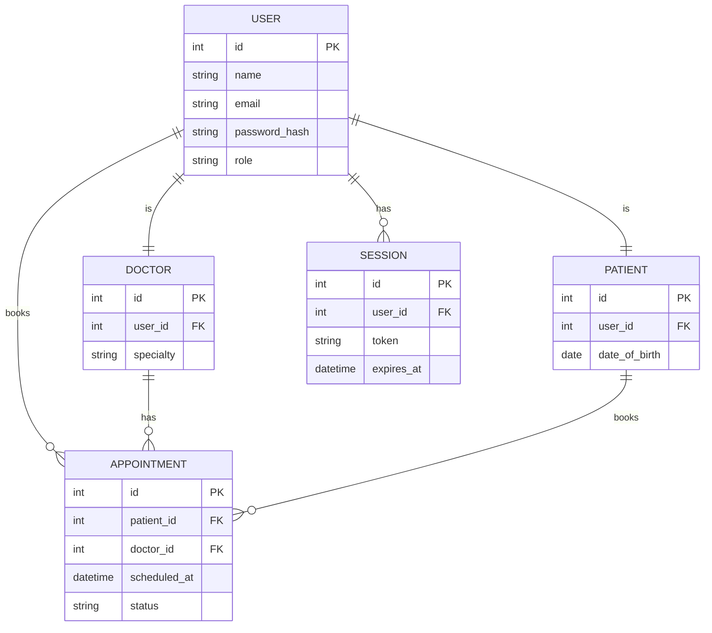

**Enterprise Health Appointment Scheduling System**

---

## 1. Product Requirements Document (PRD)

### 1.1. Introduction

The Enterprise Health Appointment Scheduling System (EHASS) enables patients, doctors, and administrators to manage medical appointments seamlessly via web and mobile interfaces. The system provides secure authentication, session management, role-based access, and real-time availability.

### 1.2. Objectives & Goals

- Provide a user-friendly portal for patients to book, reschedule, or cancel appointments.
- Allow doctors to define and update their availability slots.
- Offer administrators oversight of all appointments, users, and system health.
- Ensure HIPAA-compliant data security and high availability.

### 1.3. Scope

- Patient-facing web/mobile application
- Doctor-facing dashboard
- Administrator console
- RESTful API backend with JSON over HTTPS

### 1.4. Stakeholders

- **Patients**: book and manage appointments
- **Doctors**: manage availability and view schedules
- **Administrators**: configure system settings and oversee operations
- **System**: maintain sessions, security, and audit logs

### 1.5. Functional Requirements & API Endpoints

#### 1.5.1. Authentication & Session Management

| Method | Endpoint                | Description                                 |
| ------ | ----------------------- | ------------------------------------------- |
| POST   | `/api/v1/auth/register` | Create a new patient or doctor account      |
| POST   | `/api/v1/auth/login`    | Authenticate and return JWT + refresh token |
| POST   | `/api/v1/auth/logout`   | Invalidate current session/token            |
| POST   | `/api/v1/auth/refresh`  | Exchange refresh token for new JWT          |
| GET    | `/api/v1/auth/session`  | Validate token and return session info      |

#### 1.5.2. User Management

| Method | Endpoint                 | Description             |
| ------ | ------------------------ | ----------------------- |
| GET    | `/api/v1/users/{userId}` | Retrieve user profile   |
| PUT    | `/api/v1/users/{userId}` | Update user profile     |
| DELETE | `/api/v1/users/{userId}` | Deactivate user account |

#### 1.5.3. Doctor Management

| Method | Endpoint                                  | Description                   |
| ------ | ----------------------------------------- | ----------------------------- |
| GET    | `/api/v1/doctors`                         | List all doctors              |
| GET    | `/api/v1/doctors/{doctorId}`              | Get doctor profile            |
| GET    | `/api/v1/doctors/{doctorId}/availability` | Retrieve availability slots   |
| POST   | `/api/v1/doctors/{doctorId}/availability` | Create or update availability |

#### 1.5.4. Appointment Management

| Method | Endpoint                               | Description                               |
| ------ | -------------------------------------- | ----------------------------------------- |
| GET    | `/api/v1/appointments`                 | List appointments (filter by user/doctor) |
| POST   | `/api/v1/appointments`                 | Book a new appointment                    |
| GET    | `/api/v1/appointments/{appointmentId}` | Get appointment details                   |
| PUT    | `/api/v1/appointments/{appointmentId}` | Reschedule or update appointment          |
| DELETE | `/api/v1/appointments/{appointmentId}` | Cancel appointment                        |

### 1.6. Non-Functional Requirements

- **Performance**: 95th percentile API response < 300ms
- **Security**: JWT auth, TLS everywhere, OWASP Top 10 mitigations
- **Scalability**: Horizontal scaling behind load balancer
- **Compliance**: HIPAA, GDPR
- **Availability**: 99.9% uptime
- **Auditability**: Immutable logs for all CRUD operations

---

## 2. User Requirements Document (URD)

### 2.1. Actors

- **Patient**: Registers, logs in, views doctors, books/reschedules/cancels appointments.
- **Doctor**: Registers, logs in, sets availability, views appointment list.
- **Administrator**: Manages users, doctors, monitors system health, views audit logs.
- **System**: Handles authentication, sessions, notifications, and logging.

### 2.2. Use Cases / User Stories

1. **Patient registers**: As a patient, I want to create an account so I can book appointments.
2. **Patient books appointment**: As a patient, I want to select a doctor and time slot so I can schedule a visit.
3. **Doctor sets availability**: As a doctor, I want to define my working hours so patients can book within those slots.
4. **Patient reschedules**: As a patient, I want to change my appointment time if needed.
5. **Admin deactivates user**: As an administrator, I want to disable a user’s account for policy violations.

### 2.3. Data Model & ERD

#### 2.3.1. Entities

| Entity          | Attributes                                                                                  |
| --------------- | ------------------------------------------------------------------------------------------- |
| **User**        | `id` (PK), `name`, `email`, `password_hash`, `role` (Patient/Doctor/Admin)                  |
| **Doctor**      | `id` (PK), `user_id` (FK → User), `specialty`                                               |
| **Patient**     | `id` (PK), `user_id` (FK → User), `date_of_birth`                                           |
| **Appointment** | `id` (PK), `patient_id` (FK → Patient), `doctor_id` (FK → Doctor), `scheduled_at`, `status` |
| **Session**     | `id` (PK), `user_id` (FK → User), `token`, `expires_at`                                     |

#### 2.3.2. Relationships

- A **User** can have multiple **Sessions** (1-to-many).
- A **User** with role=Doctor maps to one **Doctor** record (1-to-1).
- A **User** with role=Patient maps to one **Patient** record (1-to-1).
- A **Patient** can book multiple **Appointments** (1-to-many).
- A **Doctor** can have multiple **Appointments** (1-to-many).

#### 2.3.3. ER Diagram (Mermaid)



## 3. Technology Stack & Go Packages

To implement EHASS in Go, the following packages are recommended:

### 3.1. Web Framework
- **Gin** (`github.com/gin-gonic/gin`): high-performance HTTP web framework with middleware support and routing.

### 3.2. JSON Serialization
- **jsoniter** (`github.com/json-iterator/go`): drop-in replacement for `encoding/json` with improved performance.

### 3.3. Authentication & Authorization
- **JWT**: `github.com/golang-jwt/jwt/v4`: JSON Web Token implementation.
- **Auth Middleware**: `github.com/appleboy/gin-jwt/v2`: JWT middleware for Gin, supports login, refresh, and identity handling.

### 3.4. Logging
- **Logrus** (`github.com/sirupsen/logrus`): structured logger with levels, hooks, and formatters.
- **Zap** (`go.uber.org/zap`): fast, structured, leveled logging.

### 3.5. ORM & Database
- **GORM** (`gorm.io/gorm` + `gorm.io/driver/mysql`): widely-used ORM supporting MySQL, migrations, and associations.
- **Ent** (`entgo.io/ent`): entity framework with code generation and type-safe queries.

### 3.6. Configuration
- **Viper** (`github.com/spf13/viper`): configuration management via env vars, JSON, YAML, etc.

### 3.7. Validation
- **Validator** (`github.com/go-playground/validator/v10`): struct and field validation, easily integrated as Gin middleware.

### 3.8. Database Migrations
- **Goose** (`github.com/pressly/goose`): SQL-based migration tool.
- **Migrate** (`github.com/golang-migrate/migrate/v4`): database-agnostic migration library.

### 3.9. Caching & Rate Limiting
- **Redis Client**: `github.com/go-redis/redis/v8`.
- **Rate Limiter**: `github.com/ulule/limiter/v3` or `github.com/gin-contrib/ratelimit`.

### 3.10. Testing & Mocking
- **Testify** (`github.com/stretchr/testify`): assertions and mocking utilities.
- **HTTPEndpoint Testing**: `github.com/gavv/httpexpect` for end-to-end HTTP tests.

### 3.11. Documentation
- **Swagger**: `github.com/swaggo/gin-swagger` + `github.com/swaggo/swag` for auto-generated API docs.
```

Give me top packages for golang to achieve this and also include jsoniter and auth modules. include gin package and for logging and best orm package for mysql


## 4. Recommended Folder Structure

Based on community best practices for scalable Go applications, here’s a suggested directory layout for EHASS (adapted from standard Go project layouts) citeturn0search0turn0search8:

```bash
.
├── cmd
│   └── api
│       └── main.go          # Entry point for the API server
├── internal                # Private application and domain code
│   ├── auth                # JWT auth, session management
│   ├── doctor              # Doctor service handlers and logic
│   ├── patient             # Patient service handlers and logic
│   ├── appointment         # Appointment booking logic
│   └── session             # Session validation and storage
├── pkg                     # Public libraries (if needed)
│   └── middleware          # Gin middleware (logging, CORS, rate limit)
├── configs                 # Configuration files (YAML, JSON)
│   └── config.yaml
├── migrations              # Database migration scripts
│   └── [timestamp]_create_tables.sql
├── scripts                 # Utility scripts (DB seeding, build)
│   └── seed_db.sh
├── docs                    # Documentation (architecture, design)
│   └── architecture.md
├── api                     # API definitions and docs
│   └── swagger
│       └── swagger.yaml
├── deployments             # Deployment configs (Kubernetes, Docker)
│   └── k8s
│       └── deployment.yaml
├── test                    # Integration and unit tests
│   ├── integration
│   └── unit
├── go.mod                  # Go module definition
└── README.md               # Project overview and setup instructions
```

**Directory explanations:**
- **cmd/api**: Main application entrypoint for the API server.
- **internal/**: Application-specific code that should not be imported by external modules.
- **pkg/**: Reusable, public-facing packages (e.g., custom middleware).
- **configs/**: Centralized configuration files loaded via Viper.
- **migrations/**: SQL or migration scripts managed by `migrate` or `goose`.
- **scripts/**: Helper scripts for setup, testing, or deployment.
- **docs/**: High-level system design, architecture diagrams, and API guides.
- **api/swagger**: OpenAPI/Swagger definitions for automated docs.
- **deployments/**: Infrastructure-as-code manifests for Kubernetes or Docker.
- **test/**: Structured tests separated by scope (unit vs integration).

This structure ensures clear separation of concerns, encapsulation of internal logic, and ease of maintenance as the project scales.

5. Dependency Installation

To add the required Go packages to your module, run the following commands:

```bash 

# Web framework
go get -u github.com/gin-gonic/gin           # Gin web framework citeturn0search1

# JSON handling
go get github.com/json-iterator/go           # jsoniter replacement for encoding/json

# Authentication & Authorization
go get github.com/golang-jwt/jwt/v4          # JWT implementation
go get github.com/appleboy/gin-jwt/v2        # JWT middleware for Gin

# Logging
go get go.uber.org/zap                       # Zap structured logging

# ORM & Database
go get gorm.io/gorm                          # GORM core
go get gorm.io/driver/mysql                  # GORM MySQL driver

# Configuration
go get github.com/spf13/viper                # Viper configuration management

# Validation
go get github.com/go-playground/validator/v10 # Struct and field validation

# Migrations
go get github.com/golang-migrate/migrate/v4  # Database migrations
go get github.com/pressly/goose              # SQL-based migrations

# Caching & Rate Limiting
go get github.com/go-redis/redis/v8          # Redis client
go get github.com/ulule/limiter/v3           # Rate limiting

# API Documentation
go get github.com/swaggo/gin-swagger         # Swagger middleware for Gin
go get github.com/swaggo/swag                # Swagger CLI tool

# Testing & Mocking
go get github.com/stretchr/testify           # Testify assertions and mocks
go get github.com/gavv/httpexpect            # End-to-end HTTP testing
      

```